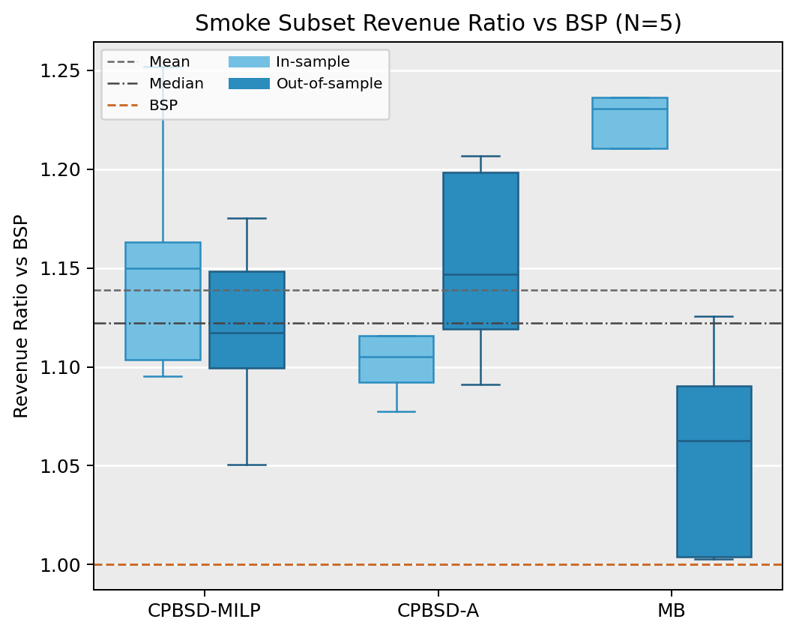
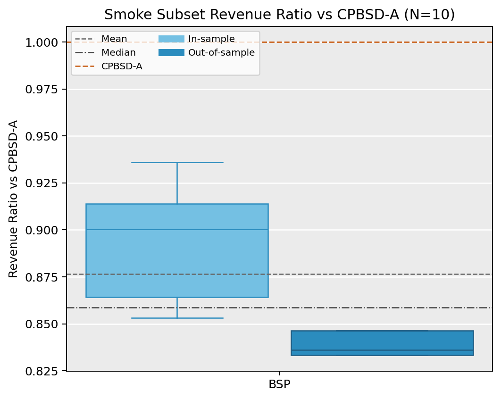

# CPBSD 与 GCN 加速迁移汇报

> 项目目录：`domains/revenue-management/project-root/CPBSD_GCN_acceleration_study`
>
> 汇报目标：系统梳理 CPBSD 的机制、CPBSD-A 的近似逻辑，以及将 MB 场景中的 GCN 加速方法迁移到 CPBSD 时，哪些部分可以保留，哪些部分需要微调，以及为什么这样调整。

---

## 1. 汇报结论先行

本次分析的核心结论有三点：

1. **CPBSD 相对 Hanson (1990) 的 tractability 优势。**
2. **CPBSD-A 固定每个顾客的产品排序 $\pi_k$，再将“选哪些产品”近似为“选前缀长度 $s$”。**
3. **MB 中的 GCN 加速范式可以迁移到 CPBSD，但迁移后的 pruning 维度应从 bundle 转为 product。**

---

## 2. CPBSD 机制介绍

### 2.1 CPBSD 的价格结构

CPBSD（Component Pricing with a Bundle Size Discount）的定价机制为：

- 每个产品设置一个 component price：$p_n$
- 每个 bundle size 设置一个按件折扣：$d_s$

若顾客购买的产品集合为 $S \subseteq \mathcal{N}$，且 $|S| = s$，则其支付为

$$
\operatorname{Pay}(S) = \sum_{n \in S} p_n - s d_s.
$$

Firm 对该 bundle 的利润为

$$
\Pi(S) = \sum_{n \in S}(p_n - c_n) - s d_s.
$$

其中：

- $p_n$ 是产品 $n$ 的标价；
- $c_n$ 是产品 $n$ 的单位成本；
- $d_s$ 是购买 $s$ 件产品时的每件折扣。

这意味着 CPBSD 不是给每个 bundle 一个独立价格，而是通过一套结构化规则生成 bundle price。

### 2.2 与 Hanson (1990) Mixed Bundling 的本质差别

#### (a) 价格空间不同

- **Hanson (1990) Mixed Bundling**：每个 bundle $S$ 都有独立价格 $p_S$。
- **CPBSD**：bundle 价格由 $(p_n, d_s)$ 生成，而不是直接对每个 $S$ 自由定价。

这可以理解为：

$$
\text{MB: } p_S : S \subseteq \mathcal{N}
\qquad \text{vs.} \qquad
\text{CPBSD: } p_n*{n \in \mathcal{N}}, d_s*{s=1}^N.
$$

因此，CPBSD 牺牲了部分价格自由度，但显著压缩了价格参数空间。

#### (b) 需求建模路径不同

- **Hanson**：直接以 bundle-level reservation values $R_{kS}$ 建模顾客对 bundle 的估值。
- **CPBSD**：从产品级随机估值出发，先定义期望利润问题，再通过 SAA（Sample Average Approximation）离散化为 MILP。

#### (c) 顾客自选择的处理方式不同

- **Hanson**：在主模型中直接写 self-selection 约束。
- **CPBSD**：先写 bundle content selection 子问题，再经 LP relaxation 与 dual reformulation 嵌入主模型。

#### (d) 防套利结构不同

CPBSD 中非常关键的一个 practical pricing restriction 是尺寸折扣的次可加性：

$$
s d_s \ge s_1 d_{s_1} + s_2 d_{s_2}, \qquad s_1 + s_2 = s.
$$

这类约束用于避免“拆单套利”。

### 2.3 CPBSD 如何刻画顾客 self-selection：BCS $\to$ BCS-LP $\to$ BCS-Dual

在给定 $(p,d)$ 和给定 bundle size $s$ 时，顾客 $k$ 需要决定买哪些产品。设：

- $x_{kns} \in 0,1$：顾客 $k$ 在 size $s$ 下是否选择产品 $n$；
- $v_n^k$：样本顾客 $k$ 对产品 $n$ 的估值。

则顾客的 bundle content selection（BCS）子问题可写为

$$
\max_{x_{kns}} \sum_{n \in \mathcal{N}} \bigl(v_n^k - p_n + d_s\bigr) x_{kns}
$$

subject to

$$
\sum_{n \in \mathcal{N}} x_{kns} = s, \qquad x_{kns} \in 0,1.
$$

这一步里：

- **给定**：$p, d, s, v^k$
- **求解**：$x_{kns}$

#### BCS-LP

将二元约束放松为

$$
0 \le x_{kns} \le 1,
$$

得到 BCS-LP。由于这一子问题具有排序型结构，原文证明在该结构下 LP relaxation 与原问题最优值一致。

#### BCS-Dual

对 BCS-LP 写对偶，引入 $\alpha_{ks}$ 与 $\beta_{kns}$，得到

$$
\min \ s \alpha_{ks} + \sum_{n \in \mathcal{N}} \beta_{kns}
$$

subject to

$$
\alpha_{ks} + \beta_{kns} \ge v_n^k - p_n + d_s,
$$

$$
\alpha_{ks} \text{ free}, \qquad \beta_{kns} \ge 0.
$$

借助 LP 强对偶，可以将顾客的最优性条件嵌入主模型，从而把双层问题单层化。

### 2.4 CPBSD-MILP 中 Firm 决策与顾客最优性的嵌入

原始逻辑是一个双层问题：

- 上层 Firm 选择 $(p,d)$；
- 下层顾客在给定价格下做最优自选择。

CPBSD 的做法是把下层最优性“编译”为 MILP 约束。

#### Firm 决策变量

- $p_n$：component prices；
- $d_s$：size-based discounts。

#### 关键辅助变量

- $x_{kns} \in 0,1$：顾客-产品-尺寸选择变量；
- $y_{ks} \in 0,1$：顾客 $k$ 是否选择 size $s$；
- $q_{kns}$：支付线性化变量，对应 $(p_n - d_s)x_{kns}$；
- $w_{ks}, w_k$：顾客 surplus；
- $\alpha_{ks}, \beta_{kns}$：BCS-Dual 变量。

#### 顾客最优性如何保证

CPBSD-MILP 的约束组可以分为四层：

1. **BCS-Dual 可行性约束**：保证 surplus 上界与 dual 最优值一致；
2. **尺寸与产品选择一致性约束**：保证“选了 size $s$”与“选了恰好 $s$ 个产品”一致；
3. **big-$M$ 支付线性化约束**：将二元选择与支付连接起来；
4. **surplus 定义与比较约束**：保证顾客不会偏离最优选择。

因此，主问题并不是“外面套一个顾客求解器”，而是将顾客理性选择完全嵌入 MILP 内部。

### 2.5 SAA 与求解器究竟在算什么

原始目标是期望利润最大化：

$$
\max \ \mathbb{E}_{V \sim F}\bigl[\Pi(p,d;V)\bigr].
$$

由于直接对分布积分求解困难，CPBSD 采用 SAA，将期望替换为 $K$ 个样本的样本平均：

$$
\max \ \frac{1}{K}\sum_{k=1}^K \Pi_k(p,d,\text{selection vars}).
$$

因此：

- 建模层面：把“理论期望”离散为样本平均；
- 求解器层面：Gurobi 求解的是一个确定性的 MILP，而不是直接做期望积分。

---

## 3. CPBSD 相对 Hanson 的 tractability 来源

CPBSD 的 tractability 来自三层结构性变化：

### 3.1 机制结构化降维

从 bundle-level 自由价格表

$$
p_S : S \subseteq \mathcal{N}
$$

压缩为

$$
p_n*{n=1}^N \cup d_s*{s=1}^N.
$$

这是 tractability 的第一性原因。

### 3.2 双层问题单层化

借助

$$
\text{BCS} \equiv \text{BCS-LP} \equiv \text{BCS-Dual},
$$

将顾客自选择“编译”为 MILP 约束，避免显式双层求解。

### 3.3 随机目标离散化

通过 SAA 把期望目标替换为样本平均目标，从而交给标准 MILP 求解器。

### 3.4 汇报口径总结

CPBSD 并不是在机制表达力上完全压过 MB；恰恰相反，CPBSD 是**主动牺牲部分自由定价能力，换取可计算性、可扩展性与更贴近商业实践的结构化价格机制。**

---

## 4. CPBSD-A：机制、$\pi_k$ 排序与近似逻辑

这一部分是本次汇报的重点，因为后续 GCN 迁移最容易先落在 CPBSD-A 上。

### 4.1 为什么需要 CPBSD-A

CPBSD-MILP 是精确模型，但变量和约束规模随 $K$ 与 $N$ 快速增长。尤其在精确模型中，核心变量块

$$
x_{kns}, \ q_{kns}, \ \beta_{kns}
$$

都具有 $O(KN^2)$ 的规模。

CPBSD-A 的目标不是保持完全精确，而是通过一个可解释的结构化近似，把“顾客选哪些产品”的问题压缩成“顾客选多大 size”的问题。

### 4.2 $\pi_k$ 排序是什么

对每个顾客样本 $k$ 和每个产品 $n$，定义一个 product-level potential surplus：

$$
z_{kn} = v_n^k - c_n.
$$

然后按 $z_{kn}$ 从大到小排序，得到顾客 $k$ 的 preference ranking：

$$
\pi_k(1), \pi_k(2), \dots, \pi_k(N)
$$

满足

$$
z_{k,\pi_k(1)} \ge z_{k,\pi_k(2)} \ge \cdots \ge z_{k,\pi_k(N)}.
$$

直观解释是：

- $v_n^k$ 越高，顾客越喜欢；
- $c_n$ 越低，Firm 卖这个产品越划算；
- 因此 $v_n^k - c_n$ 越大，该产品越像“高潜力、优先进入 bundle”的产品。

### 4.3 从“任意子集”到“排序前缀”：CPBSD-A 的核心近似

给定排序 $\pi_k$ 后，CPBSD-A 不再允许顾客自由选择任意产品子集，而是只允许选择该排序下的前缀集合。

定义顾客 $k$ 在 size $s$ 下的前缀 bundle：

$$
B_{k,s}^{\pi} = \pi_k(1), \pi_k(2), \dots, \pi_k(s).
$$

于是顾客的 bundle content selection 被近似为：

- 不再决定“选哪一组产品”；
- 只决定“选前 $s$ 个产品中的多少个”，也即只决定 size $s$。

这是 CPBSD-A 与 CPBSD-MILP 最本质的差别。

### 4.4 前缀价值、前缀成本与前缀价格

给定 $\pi_k$ 后，可以预先计算顾客 $k$ 的前缀价值与前缀成本：

$$
v_{ks}^{\pi} = \sum_{j=1}^s v_{\pi_k(j)}^k,
$$

$$
c_{ks}^{\pi} = \sum_{j=1}^s c_{\pi_k(j)}.
$$

在 CPBSD 机制下，该前缀 bundle 的价格为

$$
p_{ks}^{\pi} = \sum_{j=1}^s p_{\pi_k(j)} - s d_s.
$$

于是，顾客 $k$ 在 size $s$ 下的近似 surplus 为

$$
w_{ks} = v_{ks}^{\pi} - p_{ks}^{\pi}.
$$

### 4.5 CPBSD-A 的变量与约束在做什么

CPBSD-A 中保留的核心变量是：

- $p_n$：产品价格；
- $d_s$：size 折扣；
- $y_{ks} \in 0,1$：顾客 $k$ 是否选择 size $s$；
- $q_{ks}$：支付线性化变量；
- $p_{ks}^{\pi}$：顾客 $k$ 在排序 $\pi_k$ 下 size $s$ 的前缀价格；
- $w_{ks}, w_k$：surplus。

其目标函数可以写成

$$
\max \ \frac{1}{K}\sum_{k=1}^K \sum_{s=1}^N \bigl(q_{ks} - c_{ks}^{\pi} y_{ks}\bigr).
$$

同时，关键约束可以概括为：

$$
p_{ks}^{\pi} = \sum_{j=1}^s p_{\pi_k(j)} - s d_s,
$$

$$
\sum_{s=1}^N y_{ks} \le 1,
$$

$$
q_{ks} \ge p_{ks}^{\pi} - M(1-y_{ks}), \qquad q_{ks} \le p_{ks}^{\pi},
$$

$$
w_{ks} = v_{ks}^{\pi} y_{ks} - q_{ks}, \qquad
w_k = \sum_{s=1}^N w_{ks}.
$$

其逻辑可以概括为：

1. 先通过 $\pi_k$ 固定顾客的候选产品顺序；
2. 再由 $y_{ks}$ 决定顾客最终选取哪个前缀长度；
3. 同时优化全局价格 $(p,d)$。

### 4.6 为什么需要“保序约束”

由于 $p_n$ 是待优化变量，若不额外约束，优化后产品的净 surplus 顺序可能与原始 $\pi_k$ 不一致。为维持“前缀近似”的内在一致性，需要加入保序约束：

$$
v_{\pi_k(j)}^k - p_{\pi_k(j)}
\ge
v_{\pi_k(j+1)}^k - p_{\pi_k(j+1)},
\qquad j = 1, \dots, N-1.
$$

这个约束的经济含义是：

- 当我们预先固定了顾客的偏好顺序 $\pi_k$ 后，
- 求解出来的价格不应把这个顺序完全颠倒，
- 否则“顾客只会选择排序前缀”这一近似就失效了。

### 4.7 CPBSD-A 的 tractability 来自哪里

CPBSD-A 的 tractability 提升，来自于它把 product-content decision 从显式变量中消掉了。

在 CPBSD-MILP 中，需要处理：

$$
x_{kns}, \ q_{kns}, \ \beta_{kns},
$$

这些都是 $O(KN^2)$ 规模。

在 CPBSD-A 中，顾客层面只保留 size 选择变量：

$$
y_{ks}, \ q_{ks}, \ w_{ks},
$$

因此顾客决策部分下降到 $O(KN)$ 量级。

### 4.8 汇报口径总结

CPBSD-A 的本质不是“再发明一个新机制”，而是在 **CPBSD 机制保持不变** 的前提下，做了如下近似：

$$
\text{任意子集选择}
\quad \Longrightarrow \quad
\text{沿预设排序 } \pi_k \text{ 的前缀选择}.
$$

也就是说，它把“内容选择”的复杂度近似压缩成了“尺寸选择”的复杂度。

---

## 5. CPBSD 原文数值实验要点

### 5.1 规模与数据设定

- 产品规模：$N \in 5,10,30$
- 渐近实验：$N \in 100,300,1000$
- 样本规模：
  - 当 $N=5$ 时，$K=50$
  - 当 $N \ge 10$ 时，$K=100$
- 分布设定：
  - 5 类边际分布：exponential / logit (Gumbel) / lognormal / normal / uniform
  - 3 类相关结构：$\rho \in -0.5, 0, 0.5$
  - 3 类估值异质性：none / partial / full
  - 3 类成本场景：zero cost / HVHM / HVLM

总 setup 数量为

$$
3 \times 3 \times 5 \times 3 \times 3 = 405.
$$

每个 setup 生成 5 个实例，总计 2,025 个实例。

### 5.2 对比基线

- 当 $N=5$ 时：CP / PB / BSP / PBDC / MB / CPBSD / CPBSD-A
- 当 $N \ge 10$ 时：主要比较 CP / PB / BSP / PBDC / CPBSD-A

### 5.3 关键结论

- 在 $N=5$ 时，CPBSD 相对 BSP 的 in-sample 平均提升约为 $29.4$；
- 在 positive cost 场景下，CPBSD 相对 BSP / PBDC 优势更明显；
- CPBSD-A 与 CPBSD-MILP 在很多场景下表现接近，但计算更轻；
- 当 $N$ 增大时，论文也主要依赖 CPBSD-A 做大规模对比，这本身说明精确 CPBSD-MILP 仍然存在 tractability 压力。

---

## 6. 实验复现与运行

这一节补充当前代码层面的复现进展、运行脚本、已产出结果，以及两个实现中最关键的技术问题：`Tie-Breaking` 与 `Big-M`。

### 6.1 当前已实现的实验脚本

当前仓库内已经形成两套 `v2` 运行脚本，分别对应 smoke 验证与主实验入口。

#### (a) Smoke / sanity-check 脚本

- `code_submission_project/code_submission/src/data/run_cpbsd_baselines_v2.py`

定位：

- 用于快速验证 solver、评估逻辑、统一日志、缓存与绘图；
- **不是**论文 Section 6 的完整主实验入口，而是可快速重跑的 smoke subset。

当前 smoke 配置为：

- $N=5,\ K=50$，5 个实例；
- $N=10,\ K=100$，5 个实例；
- 方法集合：
  - 当 $N=5$：`CPBSD-MILP`、`CPBSD-A`、`BSP`、`MB`
  - 当 $N=10$：`CPBSD-A`、`BSP`
- 统一 `TimeLimit = 300s`

结果目录：

- `experiments/cpbsd_baselines_v2/`

#### (b) $N=5$ 主实验脚本

- `code_submission_project/code_submission/src/data/run_cpbsd_main_n5_v2.py`

定位：

- 用于跑 $N=5$ 的完整参数网格；
- 当前方法集合是 `CPBSD-MILP`、`CPBSD-A`、`BSP`、`MB`；
- **尚未**纳入 `CP / PB / PBDC / BCB`，因此它也不是论文“全方法版”的最终入口。

结果目录：

- `experiments/cpbsd_main_n5_v2/`
- 截至当前工作区清理时，该目录仍属于“设计中的 v2 结果目录”，并未像 `experiments/cpbsd_baselines_v2/` 那样实际落地为当前可用结果根。

### 6.2 当前已经跑出的结果

当前已经完成并可直接汇报的是 smoke subset。对应输出为：

- 统一日志：
  - `experiments/cpbsd_baselines_v2/unified_log.json`
  - `experiments/cpbsd_baselines_v2/unified_log.csv`
- 图：
  - `experiments/cpbsd_baselines_v2/plots/boxplot_ratio_vs_bsp_n5.png`
  - `experiments/cpbsd_baselines_v2/plots/boxplot_ratio_vs_cpbsd_milp_n5.png`
  - `experiments/cpbsd_baselines_v2/plots/boxplot_ratio_vs_bsp_n10.png`
  - `experiments/cpbsd_baselines_v2/plots/boxplot_ratio_vs_cpbsd_a_n10.png`

当前汇报时应明确说明：

- 这些图对应的是 **smoke subset**；
- 它们用于确认实现是否跑通、方法相对排序是否合理；
- 还不是论文完整 405 setups × 5 instances 的主实验结果。

下面两张图最适合直接放入阶段性汇报：

图 6-1 对应 $N=5$ 的 smoke subset，比较 `CPBSD-MILP`、`CPBSD-A`、`MB` 相对于 `BSP` 的 in-sample / out-of-sample 收益比。

图 6-2 对应 $N=10$ 的 smoke subset，比较 `BSP` 相对于 `CPBSD-A` 的收益比，可直接用于说明当前复现下 `CPBSD-A` 相对简单 baseline 的优势。

### 6.3 当前 smoke 结果的主要观察

#### (a) $N=5$ 下的基本排序

在当前 smoke subset 的 `N=5` 样本中，保守 replay 口径下的平均 realized revenue 为：

- `CPBSD-MILP`: in-sample `1.403`，out-of-sample `1.227`
- `CPBSD-A`: in-sample `1.386`，out-of-sample `1.264`
- `MB`: in-sample `1.370`，out-of-sample `1.163`
- `BSP`: in-sample `1.205`，out-of-sample `1.096`

因此，当前 smoke 的基本排序可概括为：

$$
CPBSD\text{-}MILP \approx CPBSD\text{-}A > MB > BSP.
$$

其中：

- `CPBSD-A` 与 `CPBSD-MILP` 均稳定高于 `BSP`；
- `MB` 在 `objective_raw` 上通常最高，但在当前保守 replay 下，realized revenue 会回落；
- 这恰好暴露出 `MB` 的 `Tie-Breaking` 口径问题。

#### (b) $N=10$ 下的基本排序

在当前 smoke subset 的 `N=10` 样本中，已完成对比的是 `CPBSD-A` 与 `BSP`。平均 realized revenue 为：

- `CPBSD-A`: in-sample `2.940`，out-of-sample `2.758`
- `BSP`: in-sample `2.589`，out-of-sample `2.359`

因此，当前结果可以简洁概括为：

$$
CPBSD\text{-}A > BSP.
$$

这与论文中“$N$ 变大后主要比较 CPBSD-A 与结构更简单 baseline”的方向一致。

### 6.4 `objective_raw` 与 `revenue_in_sample` 的含义

实验汇报时，这两个量必须严格区分：

- `objective_raw`：
  - solver 直接优化并返回的目标函数值；
  - 是“模型内部世界”的最优值。
- `revenue_in_sample`：
  - 将最终价格方案固定后，
  - 在同一批 in-sample customer 上重新模拟顾客购买，
  - 得到的 realized profit。

理论上，如果 formulation 和 replay 语义完全一致，应有

$$
objective\_raw \approx revenue\_in\_sample.
$$

若二者差距很大，通常说明：

1. formulation 语义与 replay 语义不一致；
2. 存在 `Tie-Breaking` 差异；
3. 或者 `Big-M` / 缓存 / price table 输出等实现问题。

### 6.5 `Tie-Breaking` 问题：为什么 MB 会出现“模型内部利润高，但重放利润低”

这是当前实现里最反直觉、但也最关键的一个问题。

#### 问题来源

在 Hanson (1990) 的 `MB` formulation 中，变量 $\theta_{ki}$ 表示顾客段 $k$ 购买 bundle $i$。  
理论上，$\theta_{ki}$ 应满足顾客 surplus maximization。

但在实现与汇报时，有一个语义选择必须讲清楚：

- 当某个顾客对“空 bundle”和“某个正利润 bundle”都达到 **同样的最大 surplus = 0** 时，
- replay 时到底记为：
  1. **不买**；
  2. 还是 **买那个对 firm 更有利的 bundle**。

当前汇报使用的是更保守的口径：

- 若 `max surplus <= 0`，则记为不买。

这会导致：

- `MB objective_raw` 通常高于 `MB revenue_in_sample`；
- 因为 MILP 内部可能利用零盈余无差异点，而外部 replay 不把这部分算作成交。

#### 汇报口径建议

在汇报时，建议把这一点简单说明为：

> `MB` 的模型内部自选择与外部 replay 在 zero-surplus indifference 上存在语义差异。当前图表采用保守 replay，即 zero-surplus 不成交，因此 `MB` 的 realized revenue 低于其 solver objective。

换句话说：

- 这是一个 **实现与评估语义问题**；
- 不应被误读为 “MB 求解器天然比 CPBSD 差”。

### 6.6 `Big-M` 问题：为什么它会直接改变结果而不是只影响数值稳定性

`Big-M` 不是一个单纯的数值技巧；当它设置错误时，会直接改变模型可行域。

#### (a) CPBSD-A 中的 `Big-M`

在 `CPBSD-A` 里，关键线性化是：

$$
q_{ks} = p_{ks}^{\pi} \cdot y_{ks}.
$$

这里需要的 `Big-M` 应该覆盖的是

$$
p_{ks}^{\pi},
$$

而不是单个产品价格 $p_n$。

如果误把 `M` 设成单个产品价格上界 `p_ub`，则会出现：

- 线性化约束被错误收紧；
- 本应允许的高价格前缀变得不可行；
- 最优解与利润被系统性压低。

因此，当前实现里已将默认 `Big-M` 修正为：

$$
M = N \cdot p_{ub},
$$

从而覆盖前缀价格的最坏情况上界。

#### (b) 汇报中的一句话解释

建议在汇报时简单写成：

> `Big-M` 设置过小并不会只造成“数值不稳定”，而会直接把模型的可行价格空间裁掉，进而改变最优解与实验结果。

这是一个需要特别强调的实现细节，因为它会影响：

- `CPBSD-A` 的目标值；
- 与 `BSP / MB / CPBSD-MILP` 的横向比较；
- 以及后续 GCN pruning 实验的基线可靠性。

### 6.7 当前复现状态的汇报结论

截至目前，可以较稳妥地汇报为：

1. `CPBSD-MILP` 与 `CPBSD-A` 的基础求解与统一 replay 逻辑已经打通；
2. `BSP` 与 `MB` 的 wrapper、缓存、统一日志和绘图已经实现；
3. 当前 smoke subset 已经足以用于发现并解释两个关键实现问题：
   - `Tie-Breaking`
   - `Big-M`
4. 在进入完整主实验与 GCN 加速前，baseline 语义已经基本理顺，但 `MB` 的最终汇报口径仍需明确其 zero-surplus replay 选择。

---

## 7. GCN 加速迁移到 CPBSD：哪些可以保留，哪些需要微调

这一部分对应本项目的主问题：MB 中的 GCN 加速方法，能否迁移到 CPBSD？

结论是：**可以迁移，但必须把 bundle-space 逻辑改写为 product-space 逻辑。**

### 7.1 可以直接保留的部分

#### (a) 图拓扑：二部图仍然成立

MB 中现有训练脚本使用的是：

- 一类 product node；
- 一类 customer / segment node；
- product 与 customer 之间完全连边。

这一图结构迁移到 CPBSD 后依然合理，因为 CPBSD 的顾客偏好信息本质上仍然来自顾客-产品交互。

#### (b) 学习目标形式：edge-level scoring 仍然成立

MB 的最新训练脚本本质上学的是一张顾客-产品概率矩阵：

$$
P \in [0,1]^{K \times N},
$$

其中 $P_{kn}$ 表示产品 $n$ 被顾客样本 $k$ 最终购买的概率。

这与 CPBSD 所需的“预测哪些产品值得保留”天然一致，因此：

- `edge scoring`
- `BCEWithLogitsLoss`
- `pos_weight`
- 变长 $K,N$ 上的训练方式

都可以保留。

#### (c) Safe Pruning 范式可以保留

MB 中可保留的不是“剪 bundle 的具体实现”，而是下面这个三层框架：

1. GCN 打分；
2. 保守裁剪；
3. reduced optimization。

这套“学习 $\to$ 裁剪 $\to$ 优化”的范式迁移到 CPBSD 依然成立。

### 7.2 需要微调的部分

#### (a) Pruning 维度必须从 bundle 改成 product

MB 中之所以剪 bundle，是因为下游求解器本身就是 bundle-space 的 HM / MB formulation。

而 CPBSD 的下游机制是：

- 全局产品价格 $p_n$；
- 全局尺寸折扣 $d_s$；
- 顾客在产品-尺寸空间中选择。

因此，如果仍然沿用 bundle pruning，会产生两个问题：

1. **机制错配**：训练输出是 product-level 信号，但推理阶段却回到 bundle-space；
2. **失去 CPBSD 结构优势**：CPBSD 本来就是 product/size 结构化机制，重新 bundle 化会抵消这种优势。

所以在 CPBSD 里，pruning 的基本对象应是产品，而不是 bundle。

#### (b) 图特征需要换语义

MB 当前训练图中，典型特征是：

- product node：$[c_n, \bar u_n, 0, 0]$
- customer node：$[0,0,N_k,c_k^s]$
- edge：$u_{kn}$

这套特征对 MB 合理，但对 CPBSD 不够贴近其近似机制，因为 CPBSD-A 的核心排序量是

$$
z_{kn} = v_n^k - c_n.
$$

因此，CPBSD 的特征设计应显式强调“净盈余”。

#### (c) 监督标签需要重定义

MB 数据里监督标签直接来自最优 bundle 的 product incidence matrix。

而在 CPBSD-MILP 中，最自然的 product-level label 应从最优解 $x_{kns}^\star$ 投影得到，而不是直接使用 bundle id。

### 7.3 当前 MB 图特征与建议 CPBSD 图特征对照

| 位置            | MB 当前特征                                    | CPBSD 建议特征                                                                                                              | 调整原因                        |
| ------------- | ------------------------------------------ | ----------------------------------------------------------------------------------------------------------------------- | --------------------------- |
| Product node  | $[c_n,\ \frac{1}{K}\sum_k u_{kn},\ 0,\ 0]$ | $[c_n,\ \frac{1}{K}\sum_k v_n^k,\ 0,\ 0]$                     | CPBSD 更需要显式表达净盈余与跨顾客异质性     |
| Customer node | $[0,\ 0,\ N_k,\ c_k^s]$                    | $[0,\ 0,\ -,\ -]$ | 强化顾客层面的平均价值、波动、最强产品与可盈利产品密度 |
| Edge          | $u_{kn}$                                   | $z_{kn}=v_n^k-c_n$ 或 $[v_n^k,\ v_n^k-c_n]$                                                                              | 与 CPBSD-A 的排序逻辑对齐           |

> 若追求最小改动，可先保持 edge dimension 为 1，使用 $z_{kn}=v_n^k-c_n$；若允许稍微增加模型输入维度，推荐使用双维边特征 $[v_n^k,\ v_n^k-c_n]$。

### 7.4 监督标签应如何修改

为避免与 CPBSD-MILP 中的支付变量 $q_{kns}$ 混淆，这里建议将 GCN 的监督标签记为

$$
\ell_{kn}^{\text{sel}}.
$$

它表示：

$$
\ell_{kn}^{\text{sel}} =
\mathbb{I}\text{产品 } n \text{ 在顾客 } k \text{ 的最优购买集合中}.

### 7.5 GCN 加速迁移后的三层方法

#### Layer 1: GCN Scoring

输入为顾客-产品二部图，输出 product-level score matrix：

$$
S = [s_{kn}] \in \mathbb{R}^{K \times N}.
$$

或对应概率矩阵

$$
P_{kn} = \sigma(s_{kn}).
$$

#### Layer 2: Safe Product Pruning

对于每个顾客 $k$，定义候选产品集合

$$
\mathcal{N}*k' = \operatorname{TopM}*{\text{GCN}}(k) \cup \operatorname{Topr}_{z}(k),
$$

其中：

- $\operatorname{TopM}_{\text{GCN}}(k)$：GCN 分数最高的 $M$ 个产品；
- $\operatorname{Topr}*{z}(k)$：按 $z*{kn}=v_n^k-c_n$ 排序的安全补集。

安全补集的作用是降低误剪最优产品的风险。

#### Layer 3: Reduced Optimization

在裁剪后空间上求解 reduced CPBSD-A 或 reduced CPBSD-MILP，而不改变 CPBSD 的定价机制本体。

### 7.6 迁移到 CPBSD-A：最容易先跑起来的版本

对每个顾客 $k$，先用 GCN 分数定义一个新排序：

$$
\pi_k^{\text{GCN}}(1), \pi_k^{\text{GCN}}(2), \dots, \pi_k^{\text{GCN}}(|\mathcal{N}_k'|),
$$

满足

$$
s_{k,\pi_k^{\text{GCN}}(1)}
\ge
s_{k,\pi_k^{\text{GCN}}(2)}
\ge \cdots \ge
s_{k,\pi_k^{\text{GCN}}(|\mathcal{N}_k'|)}.
$$

若出现分数并列，可用 $z_{kn}=v_n^k-c_n$ 作为 tie-break。

然后定义 restricted prefix bundles：

$$
B_{k,s}^{\text{GCN}} =
\pi_k^{\text{GCN}}(1), \dots, \pi_k^{\text{GCN}}(s),
\qquad
s = 1, \dots, |\mathcal{N}_k'|.
$$

此时，CPBSD-A 可以做两步修改：

1. **将原始手工排序 $\pi_k$ 替换为 $\pi_k^{\text{GCN}}$；**
2. **限制**

$$
y_{ks} = 0, \qquad s > |\mathcal{N}_k'|.
$$

这一步的含义是：

- 顾客仍然只从“排序前缀”里选；
- 但现在前缀不是按手工 $v_n^k-c_n$ 排，而是按 “GCN 分数 + safety 补集” 排；
- 同时顾客不允许选比候选集更长的前缀，因此自然不会触及被剪掉的产品。

这就是为什么说：**GCN 最容易先接到 CPBSD-A 上。**

### 7.7 迁移到 CPBSD-MILP：可以做，但实现更重

对于精确 CPBSD-MILP，更严格的 reduced model 应是：

$$
x_{kns} = 0 \qquad \forall n \notin \mathcal{N}_k'.
$$

但从工程角度，更稳妥的做法不是简单“只加零约束”，而是直接在 reduced index set 上重建模型，因为精确模型里成块出现的变量包括：

$$
x_{kns}, \ q_{kns}, \ \beta_{kns}.
$$

这些变量都按产品索引展开，若只做表面裁剪，模型规模仍会保留大量无意义变量。

因此，推荐顺序是：

1. 先实现 reduced CPBSD-A；
2. 再实现真正的 reduced CPBSD-MILP。

### 7.8 MB 中哪些方法可以直接保留，哪些不建议照搬

#### 可以保留

- edge-level GCN scoring
- BCE + `pos_weight`
- 安全补集思路
- add/drop 式局部搜索思想

#### 需要微调

- 图特征语义
- 监督标签来源
- pruning 对象：从 bundle 改为 product
- inference 阶段：从 bundle MILP 改为 CPBSD-A / CPBSD-MILP

#### 不建议照搬

- 直接把 GCN 输出离散成 bundle id 再回到 MB/HM 求解器

因为这会造成：

$$
\text{训练监督来自 CPBSD 机制}
\quad \text{但推理却回到 MB 机制},
$$

属于明显的机制错配。

---

## 8. 建议的汇报落地路径

### 8.1 第一阶段：最小可跑版本

1. 用 CPBSD-MILP 在小规模 $N=5$ 上生成最优解；
2. 从 $x_{kns}^\star$ 投影生成 $\ell_{kn}^{\text{sel}}$；
3. 按顾客-产品二部图训练 edge-scoring GCN；
4. 将 GCN 分数接到 CPBSD-A，形成

$$
\text{GCN ranking} + \text{safety set} + \text{reduced CPBSD-A}.
$$

### 8.2 第二阶段：精确 reduced CPBSD-MILP

在 reduced product universe 上重建：

$$
\text{Reduced CPBSD-MILP}.
$$

此时重点比较：

- revenue loss
- wall-clock time
- node count
- 最优产品覆盖率（product recall）

### 8.3 第三阶段：进一步细化

若仅用 product-level label 不足，可扩展为多任务学习：

- 主任务：$\ell_{kn}^{\text{sel}}$
- 辅任务：$y_{ks}^\star$ 或 size prediction

因为 CPBSD 相比 MB 新增的重要结构信息是 size decision，而不是 bundle id 本身。

---

## 9. 最终汇报结论

从机制层面看，CPBSD 相对 Hanson (1990) 的优势，不在于“更自由”，而在于“更结构化”；从算法层面看，CPBSD-A 的核心近似，不在于“重新发明 bundle price”，而在于“固定 $\pi_k$ 排序，把内容选择近似为前缀长度选择”；从方法迁移层面看，MB 的 GCN 加速范式是可以迁移的，但必须将 bundle pruning 改写为 product pruning，才能真正与 CPBSD 的机制结构保持一致。

因此，本项目最合理的主线不是“用 GCN 学 bundle 再套回 MB”，而是：

$$
\text{GCN product scoring}
\ \longrightarrow   
\text{safe product pruning}
\ \longrightarrow   
\text{reduced CPBSD-A / reduced CPBSD-MILP}.
$$

这一路径同时满足：

- 机制一致性；
- 工程可落地性；
- 与现有 MB-GCN 框架的最大兼容性。
