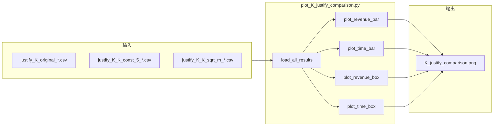

# K 策略对比可视化脚本方案

## 一、数据源与结构

**文件模式**: `justify_K_{strategy}_{dataset}.csv`

**策略**: original, K_const_5, K_const_10, K_sqrt_m, K_sqrt_mn

**数据集**: m10_n10_sample_100, m20_n10_sample_100, m30_n10_sample_100

**CSV 列**（来自 [LS_Path_Test_K_Justify.py](d:\桌面\运筹优化\BP_Code\code_submission\LS_Path_Test_K_Justify.py)）:

- `revenue_ratio`, `runtime_ratio`, `total_time`, `iterations`, `lp_solver_calls`, `K`, `max_neighbors_per_iter`

**加载逻辑**: 复用 [generate_K_justify_report.py](d:\桌面\运筹优化\BP_Code\code_submission\generate_K_justify_report.py) 中的 `load_justify_csv()` 与 `parse_filename_to_strategy_dataset()`，或直接内联实现。

---

## 二、可视化方案

### 图 1：Revenue Ratio 对比（分组柱状图）

- **布局**: 1 行 3 列，每列一个数据集（m10, m20, m30）
- **X 轴**: 5 个策略（original, K_const_5, K_const_10, K_sqrt_m, K_sqrt_mn）
- **Y 轴**: 均值 Revenue Ratio，误差棒为标准差
- **目的**: 对比各策略在不同规模下的收益表现

### 图 2：Time Ratio 对比（分组柱状图）

- **布局**: 1 行 3 列
- **X 轴**: 5 个策略
- **Y 轴**: 均值 Time Ratio，误差棒为标准差
- **目的**: 对比各策略的时间效率

### 图 3：Revenue Ratio 分布（箱线图）

- **布局**: 1 行 3 列
- **X 轴**: 5 个策略
- **Y 轴**: Revenue Ratio（100 个样本的分布）
- **目的**: 展示策略在样本层面的稳定性与离群值

### 图 4：Time Ratio 分布（箱线图）

- **布局**: 1 行 3 列
- **目的**: 展示时间比在样本层面的分布

### 图 5（可选）：Revenue vs Time 散点图（Pareto 视角）

- **X 轴**: Time Ratio
- **Y 轴**: Revenue Ratio
- **点**: 每个策略×数据集的均值点，不同颜色/形状区分策略
- **目的**: 展示收益-时间权衡

---

## 三、实现要点

### 3.1 脚本结构

```python
# plot_K_justify_comparison.py
# 1. load_all_results() -> dict[strategy][dataset] = {revenue_ratio, runtime_ratio, ...}
# 2. plot_revenue_bar(), plot_time_bar(), plot_revenue_box(), plot_time_box()
# 3. main(): 调用上述函数，保存到 K_justify_comparison.png 或分图
```

### 3.2 策略显示名称映射

| 内部名 | 图例显示 |

|--------|----------|

| original | original (2m) |

| K_const_5 | K=5 |

| K_const_10 | K=10 |

| K_sqrt_m | K=sqrt(m) |

| K_sqrt_mn | K=sqrt(mn) |

### 3.3 数据集显示名称

- m10_n10_sample_100 -> m=10, n=10
- m20_n10_sample_100 -> m=20, n=10
- m30_n10_sample_100 -> m=30, n=10

### 3.4 中文与字体

沿用 [detailed_path_visualization.py](d:\桌面\运筹优化\BP_Code\code_submission\detailed_path_visualization.py) 的配置：

```python
plt.rcParams['font.sans-serif'] = ['SimHei', 'Arial Unicode MS', 'DejaVu Sans']
plt.rcParams['axes.unicode_minus'] = False
```

### 3.5 输出文件

- 单文件: `K_justify_comparison.png`（多子图拼接，如 2x2 或 4 子图）
- 或分图: `K_justify_revenue_bar.png`, `K_justify_time_bar.png`, `K_justify_revenue_box.png`, `K_justify_time_box.png`

---

## 四、文件清单

| 文件 | 操作 |

|------|------|

| `plot_K_justify_comparison.py` | 新建：读取 CSV、生成对比图并保存 |

---

## 五、数据流示意

