# code_submission 调用关系图

```mermaid
flowchart TD
    A0["test_FCP.py::main()"] --> A1["process_data()"]
    A0 --> A2["EdgeScoringGCN 推理 / Web GCN 结果读取"]
    A0 --> A3["revenue_ratio()  (MILP)"]
    A3 --> A4["输出 test_result_threshold_vs_optimal.csv"]

    B0["test_PCP.py::main()"] --> B1["process_data()"]
    B0 --> B2["EdgeScoringGCN 推理"]
    B2 --> B3["top_m_selection()"]
    B3 --> B4["generate_progressive_bundles()"]
    B4 --> B5["revenue_ratio()  (MILP, 渐进约束)"]
    B5 --> B6["输出/打印 Top-M 结果"]

    C0["test_FCP_LS.py::main()"] --> C1["evaluate_single_dataset()"]
    C1 --> C2["process_data()"]
    C1 --> C3["predict_initial_bundles()"]
    C1 --> C4["solve_initial_milp()"]
    C4 --> C5["revenue_ratio_with_optimal_bundle()"]
    C1 --> C6["local_search_with_lp()"]
    C6 --> C7["revenue_ratio_with_optimal_bundle()  初始MILP"]
    C6 --> C8["revenue_ratio_LP()  初始LP"]
    C6 --> C9["generate_neighbor_assignments()  (2*m邻域)"]
    C6 --> C10["check_lp_feasibility_and_revenue()"]
    C10 --> C11["revenue_ratio_LP()  邻域LP评估"]
    C6 --> C12["revenue_ratio_with_optimal_bundle()  最终MILP验证"]
    C1 --> C13["汇总指标 results/search_paths"]
    C0 --> C14["np.savetxt -> test_result_local_search_mix_*.csv"]
    C0 --> C15["plot_combined_search_paths()"]

    D0["LS_Path_Test.py::main()"] --> D1["evaluate_single_dataset()"]
    D1 --> D2["process_data()  (from test_FCP_LS.py)"]
    D1 --> D3["predict_initial_bundles()  (from test_FCP_LS.py)"]
    D1 --> D4["solve_initial_milp()  (from test_FCP_LS.py)"]
    D1 --> D5["local_search_with_lp_global_topk()"]
    D5 --> D6["generate_neighbor_assignments_global_topk()  (2*K, K=ceil(sqrt(m)))"]
    D5 --> D7["check_lp_feasibility_and_revenue()  (from test_FCP_LS.py)"]
    D5 --> D8["revenue_ratio_LP()  (from test_FCP_LS.py)"]
    D5 --> D9["revenue_ratio_with_optimal_bundle()  最终MILP验证"]
    D0 --> D10["np.savetxt -> test_result_global_topk_sqrtm_*.csv"]

    E0["analyze_all_results.py"] --> E1["pd.read_csv(test_result_local_search_mix_*.csv)"]
    E0 --> E2["pd.read_csv(test_result_global_topk_*.csv)"]
    E0 --> E3["统计对比/控制台输出"]

    C14 -. 结果输入 .-> E1
    D10 -. 结果输入 .-> E2
```

## 说明

- `LS_Path_Test.py` 不重复实现底层优化器，直接复用 `test_FCP_LS.py` 中的数据处理、初始解和 LP/MILP 评估函数。
- 两条 Local Search 主线的核心区别在邻域生成：
  - `test_FCP_LS.py`：`generate_neighbor_assignments()`，每轮约 `2*m` 邻域。
  - `LS_Path_Test.py`：`generate_neighbor_assignments_global_topk()`，每轮约 `2*K` 邻域，`K=ceil(sqrt(m))`。
- 当前分析脚本文件名模式与 Top-K 输出名存在不一致：
  - 分析脚本读取：`test_result_global_topk_*.csv`
  - Top-K 实际输出：`test_result_global_topk_sqrtm_*.csv`
